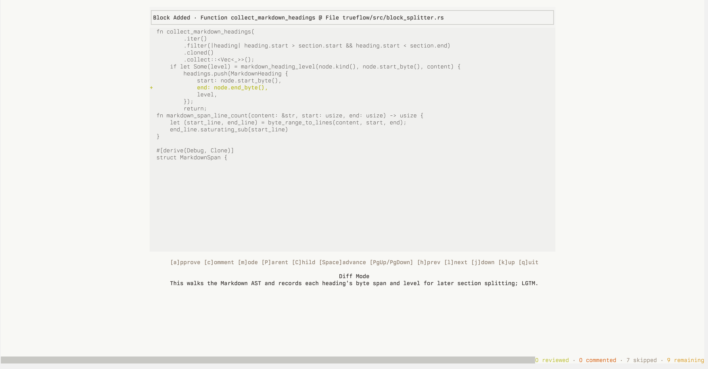

# trueflow




Trueflow is an experimental semantic code review tool.

It turns files or diffs into reviewable **blocks**, lets you review those blocks
in a CLI/TUI/Emacs workflow, and stores review state in an append-only flat file
database, e.g. `.trueflow/reviews.jsonl`.

## What it does

- scans a working tree or revision range into semantic review `blocks` (a
  `block` is some semantic unit of content, e.g. `Method`, `Struct`,
  `CodeParagraph`)
- lets you approve, reject, or comment on `blocks`
- stores review records in `.trueflow/reviews.jsonl`
- exports review feedback for an agent or other automation
- TODO: auto-integration with agents as you review

## Current model

- The canonical review unit is a **block**, not a textual diff hunk.
- Runtime config lives in `trueflow.toml`.

Still some rough edges.

- The current public CLI field name is still `fingerprint`.
- Diff fingerprints and content-addressed block identities both exist today and
  are not fully unified yet.

## Install

With Nix:

```sh
nix profile install github:trueflow-dev/trueflow
```

With Cargo:

```sh
# Install Rust and Cargo first: https://rustup.rs
git clone git@github.com:trueflow-dev/trueflow.git
cd trueflow
cargo install --path trueflow --locked
```

`cargo install` usually puts the `trueflow` binary in `~/.cargo/bin`, so make
sure that directory is on your `PATH`.

## Quick start

```sh
# Launch the TUI. The main way to use trueflow.
trueflow tui

# Review current changes as JSON. Machine-readable, suitable for integrations.
trueflow review --json


# Inspect and split a block
trueflow inspect --fingerprint <fp> --split

# Export review feedback
trueflow feedback --format xml
```

## Filter and scope review

```sh
# Review only functions
trueflow review --all --only function --json

# Exclude gaps and comments from feedback output
trueflow feedback --exclude gap --exclude comment

# Launch the TUI scoped to one file
trueflow tui --target file:src/lib.rs

# Scope the TUI to a revision range with additional filtering
trueflow tui --target rev:abc1234..def5678 --only function --exclude comment
```

Block kinds are case-insensitive and match the semantic kinds shown in JSON
output.

## Runtime config

Trueflow looks for a `trueflow.toml` file in the current directory or any parent
folder. It applies defaults for `review` and `feedback` unless overridden by CLI
flags.

```toml
[review]
only = ["function", "struct"]
exclude = ["gap", "comment"]

[feedback]
exclude = ["gap"]

[tui.keybinds]
scroll_up = "k"
scroll_down = "j"
prev = "h"
next = "l"
parent = "p"
child = "c"
approve = "a"
note = "n"
toggle_view = "m"
speed_read = "r"
root = "g"
quit = "q"

[tui.speed_read]
enabled = true
default_wpm = 320
default_chunk_words = 2
```

See `trueflow.example.toml` for the default settings.

## Interfaces

### TUI

Main review actions:

- In the root view, `j`/`k` and Up/Down move the selection through the visible file/dir list
- In the root view, `l`, Right, Enter, and `c` open the selected item; `h`, Left, and `p` are back/leftward actions and are a no-op at the repository root
- Outside the root view, `j`/`k` and Up/Down scroll code line-by-line
- `PageUp`, `PageDown`, `Space`, `Home`, and `End` scroll by page or jump to the top/bottom of the current code view
- Outside the root view, `h`/`l` and Left/Right move to the previous/next semantic sibling
- `p`/`c` move to the semantic parent/child
- `a` approve
- `n` add a note (empty note is allowed)
- `m` toggle diff/source
- `r` toggle speed-reading
- `g` jump to root
- `q` quit

To override the default TUI keys, add a `[tui.keybinds]` section to
`trueflow.toml`:

```toml
[tui.keybinds]
scroll_up = "i"
scroll_down = "m"
prev = "j"
next = "l"
parent = "u"
child = "o"
approve = "y"
note = "e"
toggle_view = "v"
speed_read = "s"
root = "z"
quit = "x"
```

### Emacs

The Emacs frontend provides a Magit-like status view and focused review flow.
Key actions include approve/reject/comment/split/refresh/review-start.

## Feedback and metadata

`trueflow feedback` exports review history for reuse by an agent or another
consumer.

The current public CLI/API field name for a review target is still
`fingerprint`. That currently coexists with separate diff fingerprints, so the
identity surface is not fully unified yet.

Review records can also carry metadata such as reviewer identity and review
labels.

## Development

```sh
# Default local gate (tests, lint, fmt)
nix develop -c just check

# Faster no-test local gate
nix develop -c just check-fast

# Full local verification path
nix develop -c just check-full

# Verify the host-default flake package
nix develop -c just nix-check

# Optional: verify the explicit release/static flake package
nix develop -c just nix-check-release

# Optional: rerun buildRustPackage's package-level test phase explicitly
nix develop -c just nix-check-with-tests

# Capture timing breakdowns for the current gate definitions
nix develop -c just measure-check
nix develop -c just measure-check-fast
nix develop -c just measure-check-full

# Generate a coverage report
nix develop -c just coverage
```

`just check` is the default local gate: tests, lint, and format checks.
`just check-fast` keeps the faster compile-only path for cases where you want a quicker no-test loop.
The heavier non-inner-loop work lives behind `just check-full`.
That heavyweight path builds only this crate's docs (not dependency docs) and measures coverage for the main lib/bin/test target set.
Bench targets are opt-in and only run through `just bench`.
Normal compile/test/lint/coverage recipes use the explicit non-bench feature set.
`just nix-check` validates the host-default flake package (`native` on Darwin, release/static on Linux).
`just nix-check-release` is the explicit release/static package build.
`just nix-check-with-tests` is the explicit opt-in path for rerunning crate tests inside the host-default Nix package build.
Timing artifacts are written under `.trueflow/measurements/`.

    The coverage report is written to `trueflow/target/llvm-cov/html/index.html`.
