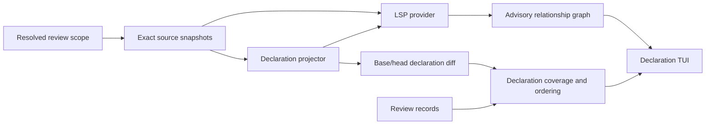

# Declaration Review mode

Status: proposed
Date: 2026-07-17

## Decision

Use **Declaration Review**.

- Product label: `Declaration Review`
- CLI/config value: `declarations`
- Rust enum: `TuiReviewMode::Declarations`
- Review check wire value: `declaration`

Do not call it “Spec Review” in the product. Signatures, documentation, and type shape are important contract evidence, but they are not a complete behavioral specification. “Declaration Review” states exactly what Trueflow can prove it presented.

## Locked product choices

1. Declaration Review is a **distinct review track**, not a visual filter over ordinary block review.
2. In diff scopes, only added, deleted, or body-free declaration surfaces whose projection changed are review targets.
3. Include top-level and member declarations at every visibility: public, restricted, package/internal, protected, private, and implicit.
4. Relationships come only from a configured, trusted language server. There is no tree-sitter/name-matching fallback presented as a call or type-use graph.
5. The TUI uses a dedicated relationship graph pane: persistent on wide terminals, full-pane replacement on narrow terminals.
6. Relationship edges are advisory context. They are never review targets, never affect declaration hashes, and never change canonical review order.

## Current constraints

Trueflow has useful pieces, but not this abstraction yet:

- `BlockKind` already distinguishes functions, methods, signatures, structs, enums, classes, interfaces, types, constants, and related forms.
- `sub_splitter` can derive function-signature review units for many languages, but its output is optimized for ordinary review, may keep short functions whole, and is not a normalized declaration API.
- `Block.hash` covers the complete stored block content. Reusing it would make body-only edits invalidate Declaration Review.
- Documentation is inconsistently attached: some language paths include leading comments in a declaration block; others emit `Comment` blocks; Python/Elisp docstrings need separate policies.
- `FileState` does not retain one canonical complete source buffer or an AST. Semantic projection must consume exact source snapshots before that information is discarded or reload the exact blob safely.
- `tree::Tree` is a containment/review tree, not a symbol or relationship graph.
- There is no LSP client, JSON-RPC transport, call hierarchy, reference index, symbol table, or persistent semantic index in the crate.
- `commands/tui.rs` currently owns the block-review application. `ViewMode::{Source, Diff}` is a presentation choice; Speed Read is a block-local overlay. Declaration Review must not become a third branch inside those enums.
- Review records are currently block/file/tree targets under `ReviewCheck::review()`.

## User-visible contract

### Included surfaces

A declaration projection contains exact source text and source ranges for the contract-bearing parts below.

#### Callable target

- recognized declaration documentation;
- attached attributes, annotations, and decorators;
- visibility and modifiers, including `async`, `unsafe`, `extern`, `const`, `static`, `abstract`, `virtual`, `override`, and language equivalents;
- declared name/operator, receiver, and labels;
- generic parameters, defaults, bounds, and where/constraint clauses;
- parameter names, labels, types, and default values;
- return/yield type and throws/effect clauses;
- a declaration terminator when it is part of the source declaration.

Excluded: callable/accessor body, local statements, local variables, local/nested declarations inside executable bodies, and ordinary non-documentation comments.

#### Aggregate/data-shape target

- recognized declaration documentation and attached attributes;
- visibility, modifiers, kind, name, generics, base types, implemented interfaces/protocols, and constraints;
- ordered field/property/tuple-element declarations;
- field/property names, visibility, modifiers, attributes, documentation, types, array lengths, bit widths, and other type-level expressions;
- enum variant names, payloads, discriminants, and order;
- auto/abstract accessor presence and modifiers as part of the owning property shape.

Excluded: concrete method bodies and ordinary runtime field/property initializer expressions.

#### Independent member targets

- methods, constructors, destructors, operators, indexers/subscripts, and required interface/trait/protocol operations are callable targets;
- associated types are independent declaration targets and are excluded from the aggregate hash;
- associated and top-level constants/statics are independent targets and include their complete declarator and value because the value is the declaration;
- nested named types are independent targets.

This ownership is exclusive: one exact surface fragment has one approval owner. Accessors are aggregate-owned; they do not also become callable targets. Multi-declarator field/property statements are aggregate-owned as one ordered shape component. A language adapter that cannot separate these roles must report partial or unsupported capability rather than duplicate or omit source silently.

### Syntactic-part policy

- One exact source declaration part is one projection node.
- Reopened namespaces/modules and partial types are not merged across files without authoritative source semantics. Each source part remains separately reviewable.
- Include file/module members and aggregate members. Exclude declarations nested inside executable bodies.
- Exclude anonymous functions, lambdas, anonymous types without a stable declared member identity, inactive preprocessor branches that the parser cannot classify reliably, and declarations produced only by macro/code generation.
- A macro declaration header may be shown; macro bodies/arms are excluded. Report partial capability when material declarations are generated rather than present in source.

### Diff behavior

For a diff-scoped review:

- added declaration: show the head projection;
- deleted declaration: show the base projection;
- changed declaration: show exact base/head projected fragments;
- unchanged projection with a changed body: omit it and report `No declaration surface changes` if the review is otherwise empty;
- relationship-only changes: do not create a review target;
- pure file move/rename with unchanged projections: do not create declaration targets, but preserve existing declaration coverage through the proven source/destination mapping;
- declaration rename, visibility change, documentation change, signature change, field/variant change, or shape reordering: reopen the affected target.

### Relationship vocabulary

Use precise relationship families and provenance:

| Subject | Display relationship | LSP source |
|---|---|---|
| function/method | `Called by` | call hierarchy incoming calls |
| function/method | `Calls` | call hierarchy outgoing calls |
| type | `Used by` | references to the reconciled type declaration, filtered to projector-classified type-use sites |
| type/data shape | `Uses types` | exact projector-classified type-name positions resolved with declaration/definition |

Optional future families such as supertype/subtype, implements, and overrides must be labeled separately. `typeHierarchy` is not type usage. `references` is not a call graph. Missing methods must produce `Unsupported by <server>`, not an empty result.

## Architecture

Keep three planes separate:



1. **Source/projection plane:** exact source, declaration components, hashes, matching, and change classification.
2. **Relationship plane:** capability-negotiated LSP sessions and advisory edges, keyed to a source generation.
3. **Presentation plane:** outline, graph pane, focus, navigation, comments, and review actions.

Neither LSP responses nor TUI wrapping may enter declaration fingerprints.

## Core domain model

Add a focused `declaration` module rather than overloading `Block`.

```text
SourceSnapshot
  snapshot_id
  path
  language
  bytes_hash
  exact_text

DeclarationNode
  id                 snapshot-local
  key                semantic/source matching key
  kind
  visibility
  parent_part
  source_ordinal
  components[]       exact source fragments and roles
  projection_hash
  review_owner       self or owning aggregate
  children[]
  type_use_sites[]

DeclarationDiffUnit
  snapshot_pair_id
  base?
  head?
  change_kind
  review_target
  matching_evidence

RelationshipEdge
  kind
  source
  target             in-review, in-workspace, external, or unresolved
  locations[]
  provenance
```

### Identity invariants

Do not conflate these identities:

- `DeclarationId`: snapshot-local UI/graph identity. Location may participate.
- `DeclarationKey`: conservative declaration-matching key: syntactic-part lineage, declaration kind/name, overload/member discriminator, and source ordinal where necessary.
- `DeclarationProjectionHash`: approval content identity. It excludes path, line/byte location, executable body, relationship facts, LSP output, and rendered layout.
- `DeclarationRecordLocator`: signed record metadata used to bind duplicate hashes safely: path, declaration key, source span/ordinal, reviewed snapshot, and projection hash.

Hash with a domain/schema prefix such as `trueflow.declaration.projection.v1`, language, target kind, then each component’s role, byte length, and exact bytes in source order. Stream these values into the hasher; do not allocate one concatenated canonical string. Length/role framing must distinguish `ab + c` from `a + bc`.

Non-contiguous declarations are valid. Documentation and signature fragments may be separated, but every fragment must map to exact UTF-8 boundaries in the same reviewed snapshot.

### Language capability contract

Extend the existing language registration seam; do not create a second grammar table.

Every `analysis::Language` must have an explicit, test-covered capability for each facet:

- declaration inventory;
- documentation association;
- callable projection;
- aggregate/data-shape projection;
- type-use-site classification.

Each facet is one of:

```text
Complete
Partial { missing_features, diagnostics }
NotApplicable { reason }
Unsupported { reason }
```

An empty result never means complete support implicitly. Before implementing adapters, lock an exhaustive per-language/per-facet matrix from representative fixtures. Do not claim a language `Complete` until its conformance fixtures prove documentation, visibility, nested/member scope, body exclusion, and data-shape ownership. Existing Rust/Swift comment attachment cannot be reused blindly because current splitters treat broad comment forms as attribute-like leading spans.

Relationship capability remains separate and runtime-dependent on the configured server.

## Snapshot and diff correctness

### Immutable Git scopes

Resolve each comparison pair once and reuse it for changed-path discovery, blob loading, hunks, projection, persistence provenance, and any relationship eligibility check.

- `main`: preserve existing mainline precedence—local `main`, local `master`, `origin/main`, `origin/master`—plus existing merge-base/fallback behavior;
- revision: first parent to revision; root commit uses the empty tree;
- revision range: start to end;
- pull request: preserve the existing ordered per-commit queue; each commit is first-parent to commit, with empty tree for a root commit;
- file/dir/all without a diff: one captured worktree generation.

Keep `ChangedPath.source_location` for base reads and `.location` for head/display identity. Never deduplicate units from distinct snapshot pairs just because hashes or paths match.

### Dirty scope

Dirty state requires a batch capture, not independent reads:

1. resolve and record HEAD;
2. capture status/endpoints;
3. load base blobs and exact worktree bytes for the selected batch;
4. compute hunks from those captured bytes rather than reopening files;
5. record file stamps/content hashes;
6. re-resolve HEAD, status/endpoints, and stamps after capture;
7. fail with `worktree changed during declaration capture; retry` on drift.

Projection, matching, diff display, and LSP request keys consume the same captured generation. Do not mix scanner output, a later worktree read, and a separately generated diff.

### Conservative declaration matching

Match recursively and never use body text or relationships:

1. match syntactic parent parts first;
2. reserve mutually unique exact declaration-key matches;
3. within overload/duplicate groups, reserve unique exact body-free projections;
4. pair a single remaining base/head candidate only when exactly one remains on each side;
5. allow a name-elided match only when it is mutually unique inside compatible matched containers/kinds;
6. use unchanged-line overlap and then constrained positional evidence;
7. leave ambiguous candidates as one deletion plus one addition and emit a diagnostic.

Reopened/partial parts remain separate. A container rename may carry unchanged child matches only when the parent match is already proven.

### Rename-stable coverage

Changed-only review must not omit a pure move while also losing existing approval.

Declaration record binding order:

1. exact signed locator: path + key + source discriminator + projection hash;
2. same path + unique key/hash;
3. proven `ChangedPath` plus conservative base/head declaration match;
4. path-independent unique semantic-key/hash fallback;
5. unique projection-hash fallback only when exactly one candidate exists.

Ambiguity leaves the declaration uncovered. A declaration’s own name change changes its projection and reopens it.

## Persistence and coverage

Declaration Review gets its own check and target kind.

### Record shape

- Add `ReviewCheck::declaration()` with wire value `declaration`.
- Add `ReviewTargetRef::Declaration { hash }`.
- Do **not** add Declaration to `ReviewTargetKind::parse_target`: that CLI resolver accepts one raw fingerprint and cannot construct the signed declaration locator/snapshot safely.
- Add a V5 `declaration_locator: Option<DeclarationRecordLocator>` field to `Record` and include it in `SignableRecordV5`.
- Add `CommentAnchor::Declaration` containing the reviewed snapshot, projection hash, and one or more exact source ranges.
- Declaration target and anchor require record version 5 and a matching declaration locator.

`ReviewTargetRef` remains the content target; the signed locator binds equal hashes to exact source occurrences without making path/position part of the body-free projection hash.

### Version and signing validation

The current `version >= 4` signing dispatch is not sufficient after adding V5 semantics.

- dispatch signing payloads by exact supported version;
- reject version `0`, versions above `CURRENT_VERSION`, and unsupported gaps;
- reject declaration targets, declaration locators, or declaration anchors on versions below 5;
- require declaration target hash, locator hash, and anchor hash to agree;
- require non-empty, ordered, in-bounds anchor ranges from one reviewed snapshot/path;
- validate on deserialize/load, before append, before signing, before verification, and before indexing;
- make the JSON schema cap the version and encode the V4/V5 declaration restrictions;
- preserve byte-identical V2/V3/V4 signing payloads for existing records.

### Structured append path

Refactor `commands::mark` into:

1. the existing CLI Block/File/Tree resolver; and
2. a common sign-and-append shell accepting an already constructed `ReviewTargetRef`, explicit reviewed `RepoRef`, explicit `BlockState`, signed locator, note/context, and anchor.

Declaration TUI actions use only the structured path. They must not call `infer_target_kind`, parse a raw fingerprint, run `block_state_for_path` on a projection hash, or recompute provenance from the current worktree at append time.

Resolve provenance once with the review item:

- immutable head/current projection: selected VCS revision, committed;
- base-only deleted projection: selected base VCS revision, committed;
- captured dirty worktree projection: captured HEAD repo ref plus uncommitted state.

### Declaration coverage index

Use a declaration-specific index over raw records and current declaration units.

- Filter by `ReviewCheck::declaration()` and `ReviewTargetRef::Declaration`.
- Bind every raw record to zero or one declaration unit using its signed locator and rename/match evidence.
- Reject ambiguous bindings.
- Only after binding, choose the latest record per bound unit by `(timestamp, append_position)`.
- `Approved` hides the unit; `Comment` and `Rejected` remain reviewable with their state visible.
- Ordinary `ReviewIndex`, `ApprovedTargets`, and `coverage::CoverageLookups` explicitly skip declaration records without emitting unresolved block diagnostics.

Two identical declarations must not collapse merely because their target hashes match.

### Batch actions

Initial Declaration Review has no file/directory “approve all” action. Navigation-only grouping rows are not review targets. An aggregate/data-shape item is one declaration target; a field/variant outline node maps visibly to that aggregate owner.

This avoids partially appended multi-record batches and repeated signing prompts. A later batch feature must prebuild/sign all records and append atomically under one store lock, with failure tests proving no partial history.

## Declaration review collection

Add a collector parallel to block review rather than projecting `CollectedReview`.

`DeclarationReviewQuery` reuses resolved scope/path/VCS selection but ignores `[review]` `BlockFilters`.

`CollectedDeclarationReview` contains:

- projection/diff units;
- remaining/commented declaration target IDs;
- deterministic canonical review order;
- snapshot-pair metadata;
- projection capability diagnostics;
- no relationship data.

Collection order is stable by diff target/PR commit, display path, head source order (base order for deleted items), declaration-kind priority, then source ordinal.

For all/file/dir scopes, include every supported top-level/member declaration regardless of visibility. For diff scopes, include only added/deleted/projection-changed targets. Fields/variants are visible graph/outline nodes but actions clearly identify their aggregate owner.

Body-only empty result, projection failure, unsupported language, and fully reviewed result are distinct states.

## LSP provider

### Dependency decision gate

Do not edit `Cargo.toml` until maintainers approve the client stack and lockfile impact. Add dependencies with `cargo add` only.

Recommended option: `async-lsp` plus its compatible runtime/types because it explicitly supports Language Clients and framed stdio operation. Keep its runtime on a dedicated analysis worker; do not introduce async concerns into the synchronous Ratatui loop.

Alternative: a small client built on a maintained protocol/message crate. A hand-written JSON-RPC/LSP implementation has lower dependency count but substantially higher lifecycle, framing, cancellation, and protocol risk. `tower-lsp` is server-oriented and is not the default choice.

No graph crate is needed initially: the UI consumes grouped adjacency results, not graph algorithms.

### Trust and configuration

A language server can execute build scripts, compiler plugins, macros, or project tooling. Treat starting it as code execution.

- fixed built-in `LspServerProfile` enums own executable names and argv;
- project/ancestor `trueflow.toml` may not specify executable paths, args, environment, shell text, arbitrary initialization options, or trust;
- trusted roots are per invocation initially (`--trust-lsp-workspace`);
- any persisted trust list must come from a provenance-preserving user-global source, not the current merged config, which loses origin;
- never install servers automatically;
- never send `workspace/executeCommand`;
- advertise dynamic registration as unsupported unless implemented atomically;
- respond safely to server requests such as `workspace/applyEdit` with `applied: false`;
- drain stderr into a bounded diagnostic ring and never let it block the child.

### Initial snapshot policy

Initial implementation supports relationship queries only against a live workspace generation that can be reconciled with the reviewed source:

- worktree/all/file/dir and dirty-head projections are eligible while relevant files remain unchanged;
- an immutable commit projection is eligible through the live server only when HEAD equals that commit and the worktree is clean enough to reconcile returned locations;
- base-only deletions and other historical snapshots show `Unavailable — historical LSP workspace not enabled`;
- revision/range/PR snapshots not represented by the current clean workspace remain declaration-reviewable but have unavailable relationship panes.

Live worktree results are labeled `LSP · live workspace (best effort)`, not immutable. Re-stat/re-hash every returned in-workspace location before projection reconciliation; discard the bundle if relevant files changed.

Historical workspace materialization is a separate future feature. It must define ordinary-blob, symlink, gitlink/submodule, LFS, generated-file, dependency, build-script, filesystem/network, cleanup, and trust policies. A temporary root is snapshot/protocol isolation, not a security sandbox.

### Session and request state

One supervised worker owns each `(server profile, workspace root)` session.

```text
SessionState
  Disabled
  Untrusted
  Starting
  Initializing
  Ready { capabilities, position_encoding, sync_kind }
  Failed
  ShuttingDown

RelationshipState
  NotRequested
  Loading { key }
  Ready { key, graph }
  Partial { key, graph, diagnostics }
  Unavailable { reason }
```

A request key includes review session, source generation/snapshot, server profile/version, declaration ID/key, document URI/version, and exact document hash.

On focus/scope/generation change:

- send `$/cancelRequest` for obsolete requests;
- detach UI interest;
- reject any late response whose full key no longer matches;
- never let a response move selection, alter coverage, or change review order.

On exit: send `shutdown`, await its response within a deadline, send `exit`, then kill only the child Trueflow spawned if it does not terminate. Bound framed message size, pending requests, cached bundles, and visible result rows; reaching a bound must yield `Partial`/`Unavailable`, never silently claim completeness.

### Document synchronization

Honor `ServerCapabilities.textDocumentSync` exactly:

- negotiate position encoding; default to UTF-16 when the server does not choose another encoding;
- use exact `languageId`, URI, text, and monotonically increasing document version;
- honor `openClose` and `None`/`Full`/`Incremental` sync kinds;
- send `didOpen`, required `didChange`, and `didClose` in protocol order;
- retain URI/version/hash/text for position conversion and returned-location validation;
- advertise `dynamicRegistration: false` until register/unregister is implemented.

### Relationship mapping

#### Callers/callees

1. call `textDocument/prepareCallHierarchy` at the exact declaration name/selection position;
2. preserve every returned `CallHierarchyItem`, including opaque `data`;
3. reconcile URI/range/selectionRange to exact declaration projections;
4. retain ambiguity if multiple credible items remain;
5. pass the selected item back unchanged to incoming/outgoing requests;
6. interpret incoming `fromRanges` in the caller document and outgoing `fromRanges`/target ranges according to the LSP direction; do not treat them as declaration spans blindly.

Only this flow creates `CalledBy` and `Calls`.

#### Type usees

- The projector identifies exact type-name positions in declaration surfaces.
- Resolve an explicit type token with `textDocument/declaration` or `textDocument/definition`.
- Use `typeDefinition` only for a value/expression position whose declared type is wanted.
- Reconcile the target to an exact projected type declaration; otherwise keep it external/unresolved.
- Label each fallback and server method in provenance.

#### Type users

- Start from the reconciled type declaration position.
- Request `textDocument/references` with an explicit `includeDeclaration` policy.
- Lazily project returned source files and retain only locations classified as exact type-use sites inside eligible declaration surfaces.
- If only an indexed subset is projected, label inverse results scope-limited.

Capability absent, method-not-found, timeout, crash, untrusted workspace, stale generation, and no configured server are distinct unavailable states. A successful empty response is `No relationships found`.

## TUI integration

### Route before collection

Add `TuiReviewMode::{Blocks, Declarations}` with clap/serde values `blocks` and `declarations`.

- Resolve optional CLI mode over configured default once at launch.
- Carry a neutral launch payload—scope/targets, PR commit queue, mode, trust—through direct launch, scope selector, and “review something else.”
- Branch to block or declaration collection before resolving block filters or building `CollectedReview`.
- Reject CLI `--only`/`--exclude` in declaration mode.
- Ignore configured `[review]` block filters for declaration collection/status.
- Namespace scope-status caches by review mode; keep the existing block cache key unchanged.
- Preserve ordered per-commit PR review behavior and carry mode/trust through every queued commit.

Do not add Declaration Review to block `ViewMode`, `UiMode`, content-frame caches, Speed Read, or existing block AI keys.

### Minimal file boundary

Keep the existing block application in `commands/tui.rs` during this feature. Add:

- `commands/tui/declaration.rs`: declaration controller/reducer/rendering integration;
- `commands/tui/declaration/graph.rs`: graph grouping and rendering;
- a separate scripted declaration TUI test harness.

Change `commands/tui.rs` only at narrow launch/router seams. Do not move the 15,000-line block app or extract speculative shared editor/layout/footer modules before Declaration Review works. Reuse `commands/tui_terminal.rs`; extract another helper only after both tracks prove real identical behavior.

### Layout

Wide inner review area, at least 100 cells:

```text
┌ Declaration Review · src/config.rs ──────────────────────────────────────┐
│ OUTLINE                                  RELATIONSHIPS                    │
│ ▾ struct Config                          Config                           │
│   "Runtime configuration."              Called by                       │
│   root: PathBuf                            > commands::tui::run           │
│   tui: TuiConfig                           config::tests::loads_defaults  │
│ > fn merge(base: Config, ...) -> Config  Calls                           │
│   fn load(path: &Path) -> Result<Config>   config::merge                 │
└───────────────────────────────────────────────────────────────────────────┘
 [a]pprove [c]omment [Tab]pane [o]relations [Backspace]back
                              Declaration Review
```

- split approximately 58/42 with minimum readable widths and one divider;
- outline always present on the left;
- graph always present on the right;
- one bright selection; inactive pane dimmed;
- signatures/headers are exact source, not generated prose;
- documentation shows exact first visual line plus a truthful continuation count;
- aggregate shape is compact but expandable;
- relationship counts may be dim annotations; target dumps stay in the graph pane.

Below 100 inner cells:

- use one full-width pane;
- default to outline;
- `o`/Enter opens graph in place;
- Esc/Backspace restores outline selection, expansion, and scroll;
- resize across the threshold preserves both pane states and any comment draft.

### Navigation

- `j/k` or arrows: previous/next visible row;
- `h/l`: collapse/expand outline item; leaf `l` may open graph;
- `P/C`: parent/first child;
- `Tab`/BackTab: switch panes when split is visible;
- `[`/`]`: previous/next relationship group/target;
- Enter on an in-scope relationship pushes a back-stack entry and jumps to that declaration;
- Backspace restores selection/expansion/scroll;
- Space advances canonical `DeclarationReviewOrder`, never graph order;
- `a`, `c`, `g`, `q`, PageUp/PageDown/Home/End preserve existing spatial meanings where applicable.

Out-of-scope, external, and unresolved graph nodes are inspectable but never actionable review targets. Navigation-only file/directory rows are not approvable.

### Async/error behavior

Relationship loading is lazy when the graph pane needs the selected declaration. The outline is immediately usable.

Render distinct states:

- `Checking…`
- `No relationships found`
- `Partial — <reason>`
- `Unavailable — <reason>`

Failure never aborts the TUI or blocks declaration approval/comment. Retry is explicit. Applying a result only updates the matching cache/pane state.

### Comments, feedback, AI, and Speed Read

- A declaration comment targets `ReviewCheck::declaration()` and the structured declaration target.
- Rendered declaration rows retain exact source-range metadata. Graph headings/edges/capability rows have no source anchors and cannot be commented on as source.
- A component-specific comment anchors that exact range. A full projection comment may contain several exact ranges.
- For GitHub delivery, use an inline comment only when one selected range maps to an eligible diff row; otherwise export/post it as general review feedback rather than inventing one line.
- Extend feedback export/resolution to understand declaration locators and persisted declaration context. Generic block feedback resolution must skip declaration records.
- Disable existing AI hints and Speed Read in Declaration Review. Current AI and Speed Read consume full `Block.content`, violating the body-free contract. Declaration-specific AI is a separate feature.

## Ordered implementation plan

### Phase 0 — Approve contracts and dependencies

1. Approve the LSP dependency/runtime option and lockfile impact.
2. Approve the fixed initial server-profile allowlist and per-invocation trust wording.
3. Lock the exhaustive per-language/per-facet projection capability matrix from representative fixtures.
4. Lock the exclusive member-ownership table above for every language adapter.

No manifest or process-launch changes occur before these approvals.

### Phase 1 — Declaration projection core

Tests first:

- body-only edit keeps the projection hash;
- docs, attributes, visibility, modifiers, signature, generics, effects, fields, variants, discriminants, and order change it;
- ordinary comments, local declarations, and relationships do not;
- exact UTF-8 source fragments round-trip;
- non-contiguous declarations work;
- concatenation collisions are impossible;
- duplicate/overloaded/partial declaration parts get distinct IDs;
- every `Language` reports every facet explicitly;
- per-language documentation and local/member-scope policies are enforced.

Production:

- add `src/declaration.rs` and `src/declaration/projection.rs`;
- extend `languages::LanguageRegistration` with declaration projection capability/callbacks;
- converge hard-coded parser selection on the same registry without changing ordinary block splitting;
- implement projectors per the approved matrix;
- parse each source snapshot once and reject invalid/overlapping source components.

Acceptance: private/public declarations appear; body-only hashes are stable; every claimed complete language passes conformance fixtures.

### Phase 2 — Snapshot capture and declaration diffs

Tests first:

- immutable main/revision/range/root-commit pairs;
- ordered PR commit pairs;
- dirty batch drift detection;
- added/deleted/renamed files;
- overload-safe and ambiguity-preserving matching;
- pure file rename preserves matching/coverage evidence;
- body-only and relationship-only diffs yield zero declaration targets;
- docs/signature/shape changes yield the expected aggregate/callable target;
- distinct target pairs are never deduplicated.

Production:

- add `src/declaration/snapshot.rs` and `src/declaration/diff.rs`;
- add batch exact-blob/worktree snapshot APIs in `vcs`;
- preserve current target/mainline/PR semantics;
- implement the conservative matching ladder and explicit diagnostics;
- cache immutable per-file projection facts by schema/language/content hash, separate from scanner cache.

Acceptance: all existing review scopes produce one exact snapshot or snapshot pair; drift fails closed; base/head text never mixes.

### Phase 3 — V5 declaration records and coverage

Tests first:

- V5 declaration target/locator/anchor round trip and signing;
- V4 declaration and future-version records are rejected;
- old V2–V4 payloads remain byte-compatible;
- duplicate equal hashes bind by signed locator before latest-verdict selection;
- body-only edits retain approval;
- surface edits invalidate approval;
- pure proven moves retain approval;
- ambiguous moves/duplicates remain uncovered;
- block and declaration checks never cross;
- declaration comments validate hash/snapshot/range consistency.

Production:

- update `store.rs`, `review_record.schema.json`, and schema tests;
- add the structured `commands::mark` append path;
- add `src/declaration/coverage.rs`;
- make generic block indexes/coverage skip Declaration explicitly;
- update verification/load validation and test constructors.

Acceptance: persisted records are auditable, duplicate-safe, snapshot-correct, and isolated from ordinary review coverage.

### Phase 4 — Declaration collection and launch routing

Tests first:

- all/file/dir/dirty/main/revision/range/PR collection;
- changed-only filtering;
- approved/commented/rejected states;
- deterministic order;
- aggregate owner mapping;
- body-only empty success versus unsupported/projection error;
- mode is chosen before block filters/collection;
- block/declaration scope cache keys are isolated.

Production:

- add `src/declaration/review.rs`;
- add `TuiReviewMode` and CLI/config plumbing;
- route direct, selector, PR, and repeat-review launches before collection;
- leave existing block collection and block TUI behavior unchanged.

Acceptance: Declaration Review is fully usable without any LSP server.

### Phase 5 — LSP client and relationship provider

Tests first, using a fake transport only:

- initialize/initialized/shutdown/exit;
- exact text synchronization for each advertised sync mode;
- position-encoding conversion;
- dynamic-registration denial and safe server-request responses;
- capability absence, method-not-found, timeout, crash, cancellation, and stale response;
- opaque call-hierarchy item round trip and direction-specific ranges;
- definition/declaration versus typeDefinition behavior;
- type-user reference filtering;
- changed returned files invalidate live best-effort results;
- process/stderr/message bounds and cleanup.

Production, after dependency approval:

- add `src/lsp.rs` and focused transport/client/provider modules;
- add fixed server profiles and trust gating;
- run the client on a dedicated worker;
- implement advisory relationship normalization/provenance;
- keep historical relationships explicitly unavailable in this implementation.

Acceptance: relationship failures degrade to declaration-only review; no heuristic fallback or false empty result appears.

### Phase 6 — Declaration TUI and graph pane

Tests first:

- reducer/outline flattening and expansion;
- aggregate target mapping;
- canonical advance independent of graph navigation;
- wide split and narrow replacement layouts;
- pane focus, graph group navigation, jump/back, resize retention;
- Unicode/wrapping/scrollbars/tiny terminals;
- loading/empty/partial/unavailable states;
- stale-result rejection;
- declaration comment ranges;
- graph rows cannot be approved/commented;
- existing block VT100 behavior remains unchanged.

Production:

- add `commands/tui/declaration.rs` and `commands/tui/declaration/graph.rs`;
- add a dedicated declaration controller and test harness;
- add only narrow routing changes to `commands/tui.rs`;
- keep block `ViewMode`, Speed Read, AI, and content caches untouched;
- add validated declaration-only keybindings.

Acceptance: dedicated graph pane works across terminal widths; relationships never control review state; approve/comment/reload works end to end.

### Phase 7 — Cross-artifact integration and smoke

After focused end-to-end behavior works:

- update every exhaustive declaration-target consumer: `ReviewTargetRef::lookup_key`, generic indexes, coverage binding, feedback export/resolution, GitHub delivery policy, verification, load validation, inspect/error paths, record constructors, and schema snapshots;
- run mixed block/declaration history regressions;
- run signed V5, unchanged-body resume, changed-surface reopen, deleted declaration, dirty drift, ordered PR commit, missing-server, timeout, and stale-cancellation scenarios;
- then perform final documentation/scaffolding cleanup. No compatibility aliases or lexical relationship fallback remain.

## Affected files

### New modules

- `trueflow/src/review_mode.rs`
- `trueflow/src/declaration.rs`
- `trueflow/src/declaration/projection.rs`
- `trueflow/src/declaration/snapshot.rs`
- `trueflow/src/declaration/diff.rs`
- `trueflow/src/declaration/coverage.rs`
- `trueflow/src/declaration/review.rs`
- `trueflow/src/lsp.rs` and focused transport/client/provider modules
- `trueflow/src/commands/tui/declaration.rs`
- `trueflow/src/commands/tui/declaration/graph.rs`
- `trueflow/tests/e2e_declaration_review.rs`

### Existing integration points

- `trueflow/Cargo.toml`, `Cargo.lock` — only after dependency approval, via `cargo add`
- `trueflow/src/lib.rs`, `commands/mod.rs`
- `trueflow/src/analysis.rs`, `languages/mod.rs`, `languages/*.rs`, language-specific parser helpers
- `trueflow/src/block_splitter.rs`, `sub_splitter.rs` — shared parser registry only; ordinary review behavior preserved
- `trueflow/src/targets.rs`, `vcs.rs` — exact snapshot pairs, dirty capture, PR/mainline semantics
- `trueflow/src/store.rs`, `commands/mark.rs`, `coverage.rs`
- `trueflow/review_record.schema.json`, `tests/schema.rs`
- `trueflow/src/config.rs`, `cli.rs`, `main.rs`
- `trueflow/src/commands/tui.rs`, `commands/tui/test_support.rs`
- `trueflow/src/feedback_export.rs`, `commands/feedback.rs`, GitHub delivery mapping where anchors are consumed
- `trueflow/src/commands/verify.rs`, inspect/error paths, generic test record builders
- `trueflow/tests/e2e_languages.rs`, relevant per-language E2E files, `vcs_scope.rs`, `e2e_diff.rs`, `e2e_mark_store_coverage.rs`, `regression_resume_review.rs`, `tui_wiring.rs`, `tui_vt100.rs`, `tui_pty_smoke.rs`

## Verification commands

Run focused tests as each phase lands. Tests requiring a real language server are supplemental; deterministic CI uses fake transport/provider fixtures.

```sh
cd trueflow
cargo test --lib declaration::projection
cargo test --lib declaration::snapshot
cargo test --lib declaration::diff
cargo test --lib declaration::coverage
cargo test --lib declaration::review
cargo test --lib lsp::
cargo test --test e2e_languages declaration_
cargo test --test vcs_scope declaration_
cargo test --test e2e_diff declaration_
cargo test --test e2e_mark_store_coverage declaration_
cargo test --test regression_resume_review declaration_
cargo test --test schema
cargo test --features tui-test-support --test tui_vt100 declaration_
cargo test --features tui-test-support --test tui_wiring declaration_
cargo test --features tui-test-support --test tui_pty_smoke declaration_
```

After the behavior smoke passes, run the repository gate:

```sh
just check
```

Manual smoke with one already-installed, approved server:

1. launch `trueflow tui --mode declarations --trust-lsp-workspace`;
2. verify only exact docs/signatures/data shape appear;
3. navigate quickly while a relationship request is loading and confirm stale output cannot replace the current graph;
4. approve a declaration, edit only its body, reload, and confirm approval remains;
5. change its signature or docs, reload, and confirm it reappears;
6. review a body-only diff and confirm the successful empty-state message;
7. verify an unsupported relationship method says unavailable rather than showing zero relationships;
8. verify no server edit/command request is accepted.

## Acceptance criteria

- Declaration Review is a separate launch-time review track named exactly `Declaration Review`.
- Projection hashes exclude executable bodies and relationships and include exact recognized docs, attributes, signatures, and owned data shape.
- Every language/facet advertises an explicit, tested capability; no silent fallback exists.
- All top-level/member visibilities are included where projection is supported.
- Member ownership has no duplicated or unowned surface fragments.
- Diff scopes contain only added, deleted, or surface-changed declaration targets.
- Dirty, mainline, revision, range, root-commit, and ordered PR snapshot semantics are exact and drift-safe.
- Matching is conservative, overload-safe, partial-part-safe, rename-aware, and snapshot-pair isolated.
- Proven pure moves preserve coverage; ambiguous moves do not.
- V5 validation prevents old/future record shapes from acquiring declaration semantics.
- Duplicate declarations bind raw records before latest-verdict selection.
- Block and declaration checks/coverage never cross.
- LSP relationships are capability-negotiated, source-reconciled, provenance-labeled, advisory, and live-best-effort where applicable.
- No language server starts from untrusted repository configuration.
- Historical relationship unavailability is explicit; no historical blob is sent to a current-worktree server.
- The wide TUI has a dedicated graph pane; the narrow TUI replaces/restores panes without losing state.
- Graph inspection cannot alter review order, approve an edge, or manufacture a source comment anchor.
- Existing block TUI source/diff, Speed Read, AI, comments, recap, and tests remain behaviorally unchanged.

## Non-goals

- Reviewing executable bodies or local statements.
- Treating declarations as a complete behavioral specification.
- Compiler-proof or exact dynamic-dispatch call graphs.
- Tree-sitter/name-only relationship fallbacks.
- Persisting or approving relationship edges.
- Making relationship changes invalidate declaration coverage.
- Installing language servers automatically.
- Arbitrary repository-configured executables, shell commands, environments, or server-requested edits/commands.
- Historical LSP workspace materialization in the initial implementation.
- Declaration-specific AI or Speed Read.
- File/directory batch approval before an atomic multi-record store path exists.
- Moving/refactoring the existing block TUI as part of this feature.

## Primary risks

1. **False semantic confidence:** mitigate with per-facet capability and edge provenance, never silent empty/fallback behavior.
2. **Snapshot mixing:** immutable pair IDs, dirty batch capture, full request keys, and stale-result rejection.
3. **Coverage instability:** path-independent projection hashes plus signed locators and proven rename migration.
4. **Duplicate binding:** bind raw records to exact units before selecting latest verdict.
5. **Language-server code execution:** fixed profiles, explicit trust, no repo commands, no server edits.
6. **LSP capability variance:** independent availability per relationship family.
7. **Dynamic languages/macros/generated code:** exact-source-only review targets; external/unresolved graph nodes and partial diagnostics.
8. **TUI regression risk:** separate declaration controller and narrow routing changes; no pre-feature block-app move.
9. **Large relationship responses:** bounded framing/cache/display with truthful `Partial`, lazy queries, and cancellation.
10. **Scope explosion:** source projection is eager only for selected review files; returned relationship locations are projected lazily.